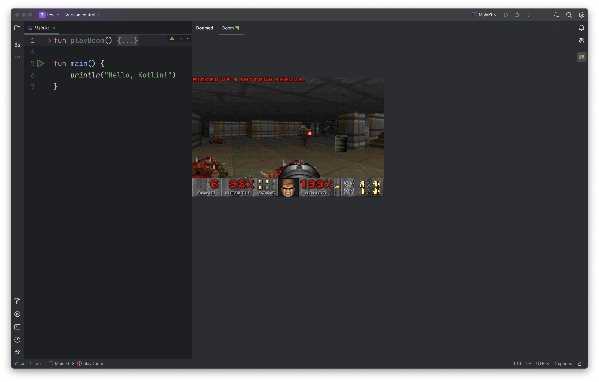

## Doom on IntelliJ

Running **Doom** on IntelliJ IDEA (or any JetBrains IDEs) is possible! 
Why don't you take a break while
your code is compiling? ☕️

### Details
This plugin integrates the excellent doomgeneric project into JetBrains IDEs.
Currently, the implementation supports macOS only. Windows and Linux support is planned for future releases
(contributions are welcome!).

### Technical Implementation
The plugin architecture is straightforward:

* JNI bindings interface with a custom native shared library (written in C/C++)
* The shared library is dynamically loaded during plugin initialization
* When creating a doomgeneric instance, we pass a DoomPanel object to the native library
* The plugin follows an inversion of control pattern where the native code drives the rendering process

### Rendering Pipeline
* The native DG_Frame function is called when a new frame is ready
* The game's framebuffer is copied to a shared memory space
* JNI callbacks transfer the buffer data to the JVM
* The buffer is converted to a renderable image format
* The image is drawn on the IDE's canvas

### Current Features
* ✅ Basic gameplay functionality
* ✅ Keyboard input support (with some limitations)
* ❌ Audio support (currently disabled)

### Audio Implementation Notes
Audio support is currently missing due to complexity considerations. Potential implementation options:
* 
* Use existing SDL bindings (though this would add significant dependencies)
* Implement a lightweight custom audio solution
* Create platform-specific audio implementations
* Contributions and improvements are always welcome! Feel free to help expand platform support or enhance
existing features.